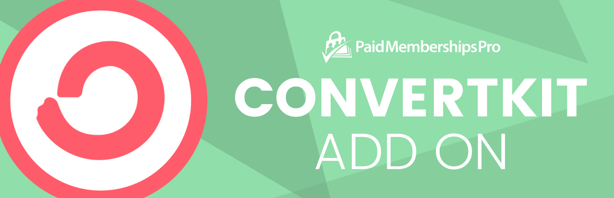

# [Paid Memberships Pro - ConvertKit](https://www.paidmembershipspro.com/add-ons/convertkit/) #
[comment]: # (Generate badges from shields.io, only works for .org plugins to get other stats etc. We'd have to create our own endpoints for Premium plugins)

 

### Welcome to the Paid Memberships Pro - ConvertKit GitHub Repository
Subscribe and tag your Paid Memberships Pro members in ConvertKit. This plugin also adds purchase data to the subscriber for their initial membership checkout in Paid Memberships Pro.

For more information please visit [https://www.paidmembershipspro.com/add-ons/convertkit/](https://www.paidmembershipspro.com/add-ons/convertkit/)

## Installation ##
For detailed installation steps, visit the [documentation](https://www.paidmembershipspro.com/add-ons/convertkit/) page.

1. Download the current development ZIP file directly: `https://github.com/strangerstudios/convertkit-paid-memberships-pro/archive/dev.zip`

**Please ensure that once installing this version of the plugin to remove `-dev` from the plugin's folder name.**

## Bugs ##
If you find an issue/bug, let us know by [creating a detailed GitHub issue](https://github.com/strangerstudios/convertkit-paid-memberships-pro/issues/new).

## Support ##
This is a developer's portal for Paid Memberships Pro - ConvertKit. We do not offer support on this channel. **Any support related questions should be directed to [https://www.paidmembershipspro.com/add-ons/convertkit/](https://www.paidmembershipspro.com/add-ons/convertkit/).**

## Contributing to Paid Memberships Pro - ConvertKit ##
We encourage and welcome any contribution to Paid Memberships Pro - ConvertKit. Please read the [guidelines for contributing](https://github.com/strangerstudios/convertkit-paid-memberships-pro/blob/dev/.github/CONTRIBUTING.md) to this repository.

There are various **ways to the help development** of Paid Memberships Pro - ConvertKit:

1. Report [bugs/issues](https://github.com/strangerstudios/convertkit-paid-memberships-pro/issues/new) on GitHub.
2. Work on any issues by submitting a Pull Request.

Here are some ways for **non-developers to contribute** to Paid Memberships Pro - ConvertKit:

1. Translate Paid Memberships Pro - ConvertKit into your own [language](https://www.paidmembershipspro.com/paid-memberships-pro-in-your-language/).
2. [Purchase a plus membership](https://paidmembershipspro.com/pricing) to help fund ongoing development and bug fixes.
